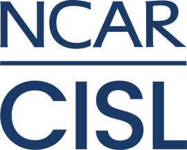

    

# Welcome to the CISL Cloud Pilot Project (CCPP)

Follow our up to date [Kanban](https://jira.ucar.edu/secure/RapidBoard.jspa?rapidView=220&projectKey=CCPP).

## ***Pilot***

***This is currently a Pilot project. Determining long term feasibility is one of our objectives.*** 

## Vision

*Provide and operate an on-premise cloud offering for the scientific community to supplement traditional HPC services and public cloud offerings while utilizing 2i2c to host a JupyterHub instance in the public cloud.*

#### What is an on-premise cloud?
NCAR | CISL runs Compute, Storage & Network hardware in robust Data Centers at multiple organizational facilities. An on-premise cloud is offering users the ability to utilize those highly available organizationally supported compute resources for approved use cases. This includes access to routable network space and UCAR Domain Name Systems (DNS). Security standards set by the organization are implemented and controlled by administrators to make sure internal policies are being adhered to. These resources would be provided to supplement computing needs that aren't fulfilled by the HPC offering, public cloud, or what is available to you locally. 

## Goals
* Improve understanding of how scientific community might use and benefit from an on-prem cloud
    * Which services fit on-prem better than traditional HPC and/or public cloud
* Gain experience within CISL deploying and operating an on-prem cloud and associated services
* Improve CISL ability to support interactive analysis workflows in environment where data is globally distributed
* Increase user visibility in to on-prem cloud offerings
* Develop metrics to showcase project value & feasibility
* Gain experience with Agile Project Management